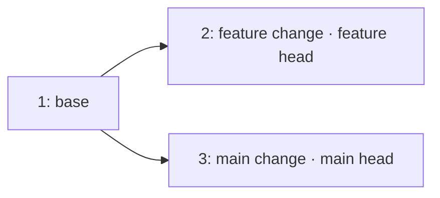
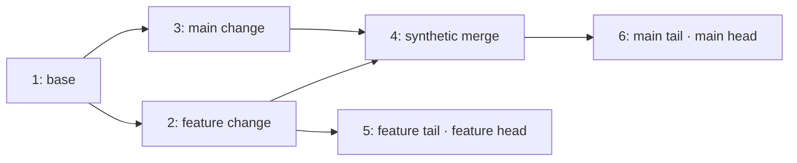

# Mini Git CTS · 평가 전 자기 점검

이 CTS는 **Codyssey 공식 채점기나 PASS 예측이 아니다.** 확인한 근거는 이 폴더의 [README](README.md)와 self-os의 `Docs/codyssey/codyssey-orientation.md`다. 오리엔테이션에는 Mini Git의 DAG·그래프·탐색·정렬 목표만 있고, LMS의 상세 채점표는 이 로컬 자료에서 확인되지 않았다. `cts.py`의 `basis=local CLI behavior` 항목은 현재 CLI가 약속하는 오류 응답과 상태 보존을 살핀다. 실제 평가 전에 LMS 원문과 서로 다른 부분이 있는지 확인해.

## 한 번에 실행

```sh
cd /home/ljh/self-os/Codyssey/mini-git
python3 cts.py
```

종료 코드 0은 선택한 로컬 항목이 전부 PASS, 1은 FAIL 또는 SKIP이 있다는 뜻이다. 결과는 [cts-report.json](cts-report.json)에 기록된다. 각 항목은 ID·단계·근거·결과·실패 이유를 남기고 검사 대상 `main.py`의 SHA-256도 기록한다. `--source 다른/main.py`로 별도 후보를 검사할 수 있다. CTS는 검사 대상 파일을 임시 디렉터리에 복사해서 실행하며 실제 `.git`, 작업 파일, 저장소 상태를 수정하지 않는다. 선택 확장은 `python3 cts.py --stretch`로 실행한다.

2026-10-06 현재 원본에 `python3 cts.py --stretch`를 실행한 결과: **PASS 29 · FAIL 0 · SKIP 0**. 기본 27개와 선택 확장 2개가 모두 통과했다. `@dataclass`를 `class Commit` 바로 앞으로 옮겨 문법 오류를 고쳤고, commit 상태 갱신 순서와 LOG·PATH·ANCESTORS 순회를 정리한 실제 `main.py`를 검사했다. 아래 atom state와 조합 walk 5개도 포함한다.

## 1–3시간 복습 경로

시간은 프로그램 실행 시간이 아니라 평가 전 직접 추적하고 설명하는 데 쓰는 시간이다.

| 공부 시간 | 실행 | 직접 확인할 것 |
|---|---|---|
| 1시간 | `python3 cts.py --stage 1` | `INIT → COMMIT → BRANCH → SWITCH → COMMIT`의 head와 parent를 종이에 그린다. 기본 `LOG`가 왜 parent를 먼저 출력하는지 말로 설명한다. |
| 2시간 | `python3 cts.py --stage 2` | 다른 branch의 commit으로 가는 `PATH`를 BFS 큐 순서로 추적한다. `ANCESTORS`는 parent만 따르고, keyword 검색은 `lower().split()` token 교집합을 쓰는 이유를 확인한다. 재초기화·중복 branch·없는 hash 뒤 상태도 살핀다. |
| 3시간 | `python3 cts.py --stage 3` | timestamp를 일부러 뒤집어 `date` 정렬을 확인하고 author 정렬 및 stable merge sort를 설명한다. 원하면 `--stretch`로 CLI가 만들지 않는 다중 parent DAG를 주입한 경로 동률 사례도 본다. |

매 단계는 그 이전 단계도 함께 실행한다. 오류가 나오면 JSON의 첫 `FAIL`을 보고 해당 상태 전이와 인덱스 갱신 지점을 찾으면 돼. 수정 후 같은 명령으로 재검사하고, 무엇을 고쳤는지 스스로 설명해 봐.

## 평가에서 설명해 볼 질문

1. 새 commit의 parent는 언제 확정되고, branch head는 언제 바뀌나? 다른 branch head는 왜 그대로인가?
2. `children`은 `parents`와 어떤 관계이며 `PATH`에는 왜 둘 다 필요한가? `ANCESTORS`에는 왜 parent만 필요한가?
3. BFS가 최소 간선 경로를 보장하는 조건은 무엇인가? 다중 parent의 동률 경로에서는 이 구현이 어떤 이웃을 먼저 고르나?
4. `SEARCH login`은 `logins`를 찾나? 대소문자와 중복 token, 여러 token을 현재 코드가 각각 어떻게 처리하나?
5. `LOG` 기본 순서와 `--sort-by=date`, `--sort-by=author`의 기준은 어떻게 다른가? stable merge sort에서 비교가 `<=`인 이유는 무엇인가?
6. `INIT`을 다시 하면 commit hash `0000001`이 재사용될 수 있다. 이 hash의 유일성 범위는 어디까지인가?

## CTS 자체 점검 기록

- 변경 전 원본 `main.py`: 문법 오류를 정확히 FAIL로 기록하고 의존 항목은 SKIP으로 기록했다.
- 원본을 임시 디렉터리에 복사해, 이미 제안된 `@dataclass` 위치 수정 **한 곳만** 적용한 진단 후보: 기본 23/23, `--stretch` 포함 24/24 PASS. 이것은 원본 PASS가 아니다.
- 별도 임시 후보에서 branch 생성 시 head 복사를 망가뜨리자 `branch_fork` 등에서 실패했고, merge sort의 `<=`를 `<`로 바꾸자 `stable_merge_sort`에서 실패했다. 두 경우 모두 CTS 종료 코드 1을 확인했다.
- 현재 원본 `main.py`: atom state와 조합 walk를 포함한 CTS의 `--stretch` 29/29 PASS, 종료 코드 0을 확인했다.
- 상태 walk 진단 후보: LOG가 `next_id`를 1 올리도록 임시 복사본을 바꾸자 기존 case는 통과하고 `fork_query_walk`, `empty_branch_roots_walk`, `multiparent_walk`는 FAIL했다.

필수 기능을 넘어서는 `multiparent_tie_break`와 `multiparent_walk`는 **선택 확장**이다. 현재 CLI에는 merge 명령이 없어 다중 parent 상태를 직접 만들 수 없기 때문이다. 이 항목들은 내부 자료구조에 두 번째 parent를 주입해 README의 DAG 순회와 경로 동률 설명을 점검한다.

## Case graph · atom state와 조합 walk

여기서 atom은 상태를 한 번 바꾸는 동작 하나다. 먼저 `BRANCH`, `SWITCH`, `COMMIT`
직후 상태를 보고, 순회 안에서는 pop·첫 방문·edge 처리에 따른 변화를 따라간다.
아래 `1`, `2` 등은 실제 hash `0000001`, `0000002`를 줄인 표기다.
그래프의 화살표는 **parent → child**다. `PATH`는 그 연결을 양방향으로 사용한다.

근거는 [main.py](main.py)의 상태 갱신과 순회, [cts.py](cts.py)의 `new_repo`, `fork`,
아래 다섯 case다. 명령 직후 상태와 결과는 case가 검사한다. 아래 queue·indegree·stack
중간 상태는 해당 소스의 실행 순서에서 재구성한 walk다. 각 case는 새 repository에서
독립적으로 시작한다.

| Case | 이어 붙이는 동작 | 확인하는 관계 |
|---|---|---|
| `atom_state_walk` | INIT → COMMIT → BRANCH → SWITCH → COMMIT | head 복사·선택·이동, parent/children, index 추가 |
| `fork_query_walk` | fork → LOG → PATH → ANCESTORS → SEARCH → LOG → COMMIT | 조회가 상태를 보존하고 다음 commit에 연결되는지 |
| `rejected_transition_walk` | fork → 중복/없는 대상 → SWITCH → COMMIT | 실패 뒤 상태 보존과 다음 정상 전이 |
| `empty_branch_roots_walk` | INIT → 빈 BRANCH → 각 branch에 COMMIT | 독립 root, 연결 없음, component 안의 경로 |
| `multiparent_walk` (`--stretch`) | fork → 두 parent 주입 → 양쪽 tail → 조회 조합 | parent 둘의 준비, 조상 범위, 최단 경로 동률 |

`state(repo)`는 branch head뿐 아니라 initialized·user·current branch·commit metadata·
parents·children·두 index·next ID를 복사한다. 그래서 `BRANCH`와 `SWITCH`가 약속한
부분만 바꾸는지, 조회와 오류 응답이 저장된 상태를 바꾸는지 비교할 수 있다.

### 한 명령씩 상태를 바꾸기

`atom_state_walk`의 message는 `Base base`, `Feature API`다.

| Atom | current branch | branch heads | 새 관계 |
|---|---|---|---|
| `INIT Alice` | main | main=None | graph/index 비움, next ID=1 |
| `COMMIT "Base base"` | main | main=1 | parents[1]=[], children[1]={}, keyword base=[1], author alice=[1], next ID=2 |
| `BRANCH feature` | main | main=1, feature=1 | 현재 head 값을 새 branch에 복사 |
| `SWITCH feature` | feature | main=1, feature=1 | 선택한 branch만 변경 |
| `COMMIT "Feature API"` | feature | main=1, feature=2 | parents[2]=[1], children[1]={2}, keyword feature/api=[2], author alice=[1,2], next ID=3 |

마지막 COMMIT 안에서는 다음 순서로 상태를 만든다. 기존 node 1의 metadata와
parents는 그대로 남고, `children[1]`에는 새 child만 추가된다.

| 내부 atom | 변경 직후 |
|---|---|
| 현재 head 읽기 | 로컬 parent=1, parents=[1] |
| `_new_hash()` | 로컬 hash=2, next ID=3 |
| `Commit(...)` 생성 | 로컬 node 2 생성, timestamp 확정 |
| commit table에 넣기 | commits[2]=node 2 |
| children slot 만들기 | children[2]={} |
| parent의 reverse edge 추가 | children[1]={2} |
| author index에 넣기 | alice=[1,2] |
| keyword token에 넣기 | feature=[2], api=[2] |
| 선택한 branch head 옮기기 | feature=2; main=1 |

### Fork에 조회와 다음 COMMIT 붙이기

`fork_query_walk`의 첫 상태는 기존 `fork(ctx)`가 만든다.



`LOG`는 저장된 parents/children을 읽고 로컬 indegree와 ready를 만든다.
아래 ready는 힙에서 꺼낼 순서로 표시한다.

| Walk atom | 남은 indegree (1,2,3) | ready | 출력 |
|---|---|---|---|
| 초기화 | (0,1,1) | [1] | [] |
| 1을 pop, children 2·3의 edge 처리 | (0,0,0) | [2,3] | [1] |
| 2를 pop | (0,0,0) | [3] | [1,2] |
| 3을 pop | (0,0,0) | [] | [1,2,3] |

edge 하나를 처리할 때마다 그 child의 indegree를 1 줄인다. 0이 되는 순간에 ready에
넣는다. children의 방문 순서와 무관하게 힙에서 2가 3보다 먼저 나온다.

`PATH 2 3`에서는 첫 방문에 previous를 쓰고 queue에 넣는다.

| Walk atom | queue | previous에 추가 | 경로 |
|---|---|---|---|
| 시작 | [2] | 2=None | 아직 없음 |
| 2를 pop, 이웃 1 첫 방문 | [1] | 1=2 | 아직 없음 |
| 1을 pop, 이웃 2는 방문됨, 3 첫 방문 | [3] | 3=1 | 아직 없음 |
| 목적지 3을 pop | [] | 없음 | previous를 따라 [3,1,2], 뒤집으면 [2,1,3] |

LOG → PATH → ANCESTORS → keyword/author SEARCH → LOG를 실행한 뒤에도 저장된
repository 상태는 같다. 그 상태에 `COMMIT "main tail"`을 붙이면 node 4의 parent는
3이고 heads는 main=4, feature=2다. `PATH 2 4`는 [2,1,3,4]가 된다.

`ANCESTORS 4`는 parent 쪽으로 발견한 집합을 순회한다.

| Walk atom | stack | found |
|---|---|---|
| parents[4]로 시작 | [3] | {} |
| 3을 pop·등록, parent 1 추가 | [1] | {3} |
| 1을 pop·등록, parent 없음 | [] | {1,3} |

그 집합의 indegree는 1=0, 3=1이다. 1을 꺼내 children을 볼 때 2는 집합 밖이므로
넘기고, 3의 indegree만 0으로 내려 결과 [1,3]을 만든다.

같은 상태에서 `SEARCH "main change"`의 candidates는 다음처럼 줄어든다.

```text
main   index: [3,4] → candidates={3,4}
change index: [2,3] → candidates={3,4} ∩ {2,3} = {3}
result: [3]
```

### 거절과 빈 branch를 조합하기

`rejected_transition_walk`는 fork 상태에서 중복 BRANCH, 없는 SWITCH·PATH·ANCESTORS,
일치하지 않는 SEARCH를 차례로 실행하고 매번 전체 state가 같은지 본다. 그 뒤 feature로
SWITCH해 COMMIT하면 hash 4를 쓰고 parent=2, main=3, feature=4가 된다.

`empty_branch_roots_walk`는 **첫 COMMIT 전에** other branch를 만든다.

```text
INIT                  heads={main:None}
BRANCH other          heads={main:None, other:None}
COMMIT "main root"    heads={main:1,    other:None}, parents[1]=[]
SWITCH other          current=other
COMMIT "other root"   heads={main:1,    other:2},    parents[2]=[]
```

1과 2는 서로 연결되지 않는다. `PATH 1 2`는 `([], None)`으로 끝나고 CLI는
`No path`를 출력한다. 없는 hash의 `Unknown commit`과는 반환 경로가 다르다.
LOG와 SEARCH는 root 둘을 포함한다. other에 child 3을 추가하면 `PATH 2 3`은 [2,3],
`ANCESTORS 3`은 [2]이고, `PATH 1 3`은 여전히 연결이 없다.

### 다중 parent와 양쪽 tail을 조합하기

`multiparent_walk`는 기존 fork에 node 4를 만들고 두 번째 parent를 직접 주입한다.
그 뒤 feature와 main에 각각 tail을 붙인다. 이 fixture는 `--stretch`로 실행한다.



node 4의 초기 indegree는 2다. 2를 처리하면 4는 1이 되고 ready에는 [3,5]가 남는다.
3을 처리해야 4가 0이 되어 ready=[4,5]가 된다. 전체 LOG 결과는 [1,2,3,4,5,6]이다.

```text
ANCESTORS 6 → [1,2,3,4]      양쪽 parent를 포함하고 sibling tail 5는 제외
ANCESTORS 5 → [1,2]          feature의 parent 쪽만 포함
PATH 5 6    → [5,2,4,6]      merge를 지나는 최소 간선 경로
PATH 2 3    → [2,1,3]        [2,4,3]과 동률; 작은 이웃 1을 먼저 방문
SEARCH tail → [5,6]          두 branch의 tail을 index에서 선택
```

이 조회 조합 뒤에도 저장된 DAG·heads·indexes·next ID는 그대로 남는다.
